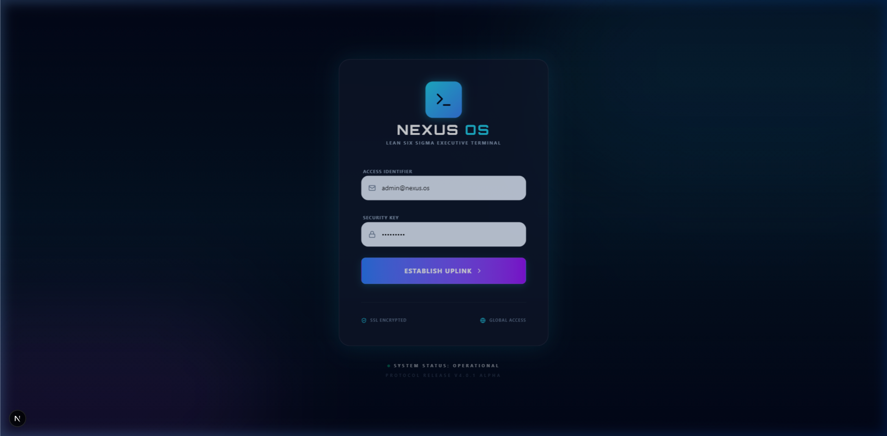
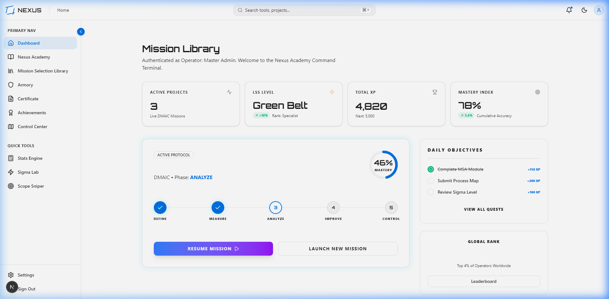
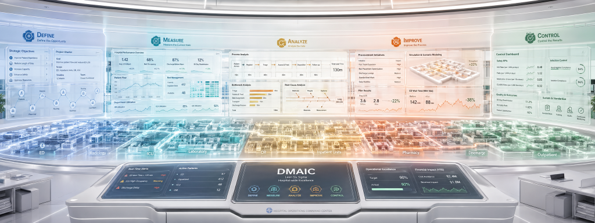
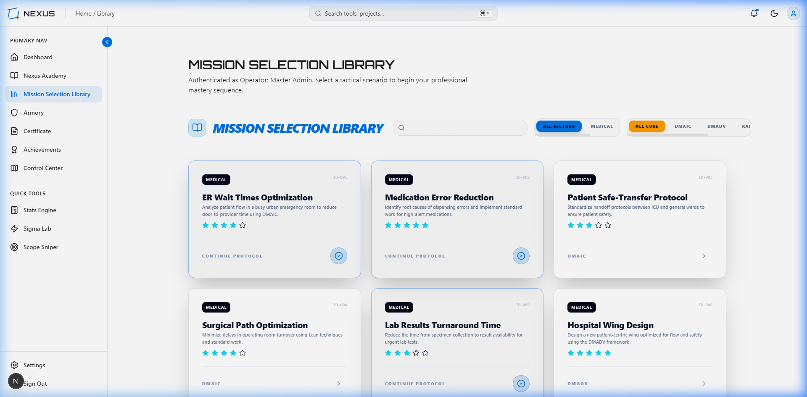
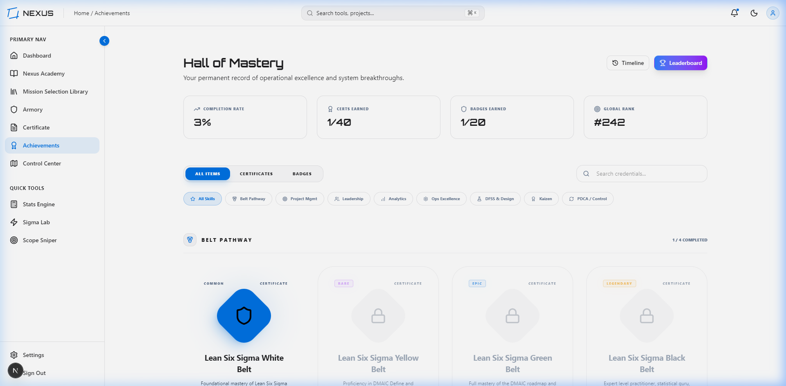

# Nexus OS: The Operator's Field Guide

Welcome to **Nexus OS**, the world's most advanced Lean Six Sigma Executive Terminal. This guide will help you navigate the ecosystem with the precision of a Master Black Belt.

---

## 🚀 1. The Uplink (Login)

*   **Action**: Enter your **Access Identifier** and **Security Key** into the Nexus OS Terminal.
*   **Visual**: Experience the terminal-style boot sequence that authenticates your rank and initializes the "Nexus Shell."

## 🏛️ 2. The Command Dashboard (Mission Control)

*   **Center Stage**: View your **Active Protocol** (Current Project).
*   **Live Metrics**: Track your **Mastery Index**, **Total XP**, and **Global Rank** in real-time.
*   **Daily Quests**: Check your "Daily Objectives" to gain quick XP and maintain your rank.

## 🎓 3. The Academy (Path to Mastery)

*   **Choose Your Framework**: Use the top tabs to switch between **DMAIC**, **DMADV**, **KAIZEN**, or **FOCUS-PDCA**.
*   **Explore Roadmap**: Click the glowing sidebar tab to visualize your entire journey through 32:9 cinematic panoramas (as shown above).
*   **Launch Tools**: Each lesson is linked to a professional tool in the "Armory." Click a lesson to establish a tool-uplink and begin execution.

## 🛠️ 4. The Armory (Tools of the Trade)

*   **Execution**: Use the premium statistical calculators and management templates.
*   **Sensei Wisdom**: Keep an eye on the **Sensei MBB** banner for real-time pro-tips and methodology "easter eggs."
*   **Sync**: All data is automatically synced to your active mission board.

## 🏆 5. The Hall of Mastery (Achievements)

*   **Tiered Unlocks**: Visit the achievements hub to view your unlocked badges and certificates.
*   **Belt Progression**: Watch as your status evolves from Yellow Belt to Master Black Belt through completed modules and earned XP.

---

## ⚡ Pro-Tips for the Elite Operator
1.  **Follow the Glow**: Elements that are currently "available" or "recommended" will feature a methodology-specific neon glow.
2.  **Toggle Frameworks**: Exploring different frameworks (e.g., KAIZEN) will re-skin the entire terminal instantly. Use this to find the best tool for your specific problem.
3.  **Check Your XP**: High XP multipliers are awarded for completing "Premium" modules (marked with a special icon).

---

**Protocol Initiated. Good luck, Operator.**
